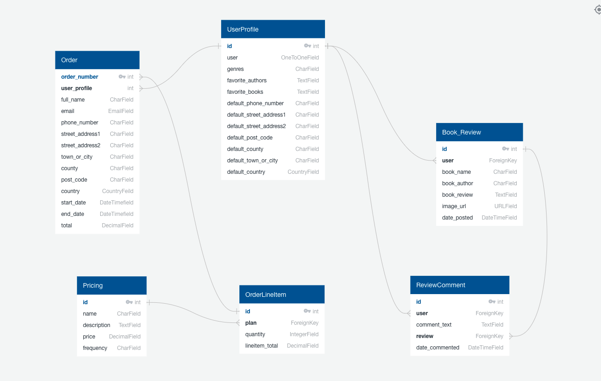
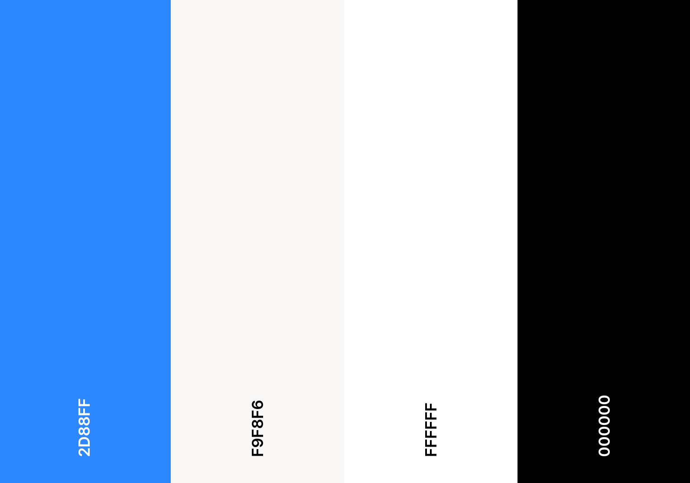
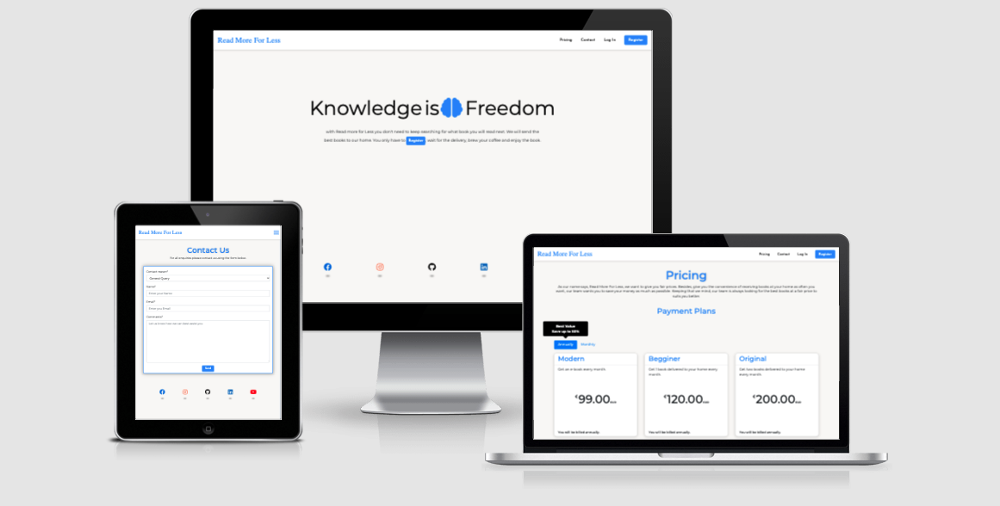

# Read More For Less


Read more for Less is a project where users can make a purchase to get a box of books, they can choose between single delivery or get a monthly delivery for one year.
I felt there is a pain in the market with subscriptions, that some people don't do a subscription because they know it might be a pain to cancel it, in this project
the user can buy a box of books for only one single month and if they like the service than they get can the annually plan. To don't get any random book, users are
able to set their preferences, such as genre, authors and books they enjoyed. Also, the website has a Book Club page, where users can create reviews about the books
they are reading and discuss them with other users.

### [Live site](https://read-more-for-less.herokuapp.com/)

## Table of Contents:
-  [UX](#ux)
    -  [User Stories](#user-stories)
    -  [Strategy](#1-strategy)
    -  [Scope](#2-scope)
    -  [Structure](#3-structure)
    -  [Skeleton](#4-skeleton)
    -  [Surface](#5-surface)
-  [Features](#features)
    -  [Existing Features](#existing-features)
    -  [Features to consider implementing in the future](#features-to-consider-implementing-in-the-future)
-  [Technologies Used](#technologies-used)
    -  [Languages](#1-languages)
    -  [Integrations](#2-integrations)
    -  [Workspace, Version Control, and Repository Storage](#3-workspace-version-control-and-repository-storage)
-  [Resources](#resources)
-  [Testing](#testing)
-  [Deployment](#deployment)
-  [Credits](#credits)
-  [Acknowledgments](#acknowledgments)

## UX
### User Stories

- As a non-member, I want to visit the homepage to have an overview of what the site is about and the pricing page to check the prices.

- As a user, I want to easily understand the main purpose of the website so that I immediately know what the site is intended for upon entering.

- As a user, I want to be able to view the site on any device I may have, (mobile/tablet/desktop).

- As a user, I want to easily sign up to the website.

- As a user, I want to easily log in and log out on my account.

- As a user, I want to be able to purchase a single instead of the regular one-year subscription.

- As a user, I want to set my Profile preferences and save them.

- As a user, I want to check when my plan expires.

- As a user, I want to participate of the Book Club, Creating, Editing and Deleting posts with my profile.

- As a user, I want to see my reviews in my profile with a direct link to the review page.

- As a user, I want to be able to search for reviews.

- As a user, I want to contact the website management to clarify doubts.

- As an admin/superuser, I want to recieve a confirmation email when a contact form is submitted.

- As an admin/superuser, I want to have the ability to update site content.

### 1. Strategy

As a person that loves to read, sometimes I spend more time looking for new books than actual reading. Keeping that in mind Read more for Less was created to facilitate chose a book. As time is a priceless asset, the users only need to provide information on what genre of books they like. If they want, they also can inform the authors and books they enjoy for a more precise chose.
  
####  Site Goals

- Provide an easy navigation website.

- Give a way to users easily chose a plan and checkout.

- Provide a platform where users can create book reviews and interact with other users.

- Offer easy interaction on the page.

### 2. Scope

- Fits in with my current skill-set of HTML, CSS, JavaScript, Python and Django.

- Website information clearly relayed upon entering the home page.

- Easy way to Sign Up, Log in and Log out.

- Easily purchase a new plan. 

- Allow users to create, read, update and delete reviews.

- Allow users to comment on reviews from other users.

- Allow admin create, read, update and delete plans.
  
### 3. Structure

The idea of the website is simple. Allow the user to buy a plan to receive books every month for one year at home or buy
it each month they desire and get a single delivery for each purchase. Also, after sign in the user will be able to create,
update, and delete book reviews in an exclusive Book Club, they will be able to add comments to the reviews as well.

The website has the same design to keep consistency and provide easy and friendly navigation to the user.

A clear communication is provided to the user after some interactions, using the messages function in Django.

### 4. Skeleton
-  [Wireframes](docs/wireframes/wireframe.pdf)
- Navigation bar - Menu with links pointing to each page
    - **Home** - A short description letting the user knows what the website is about with a direct link to the registration page.
    - **Pricing** - Users can find details about the plan options.
    - **Cart** -  Provide details of the purchase. If the user has nothing in their cart, they are invited to go to the pricing page
    - **Checkout** - Users can check a purchase summary and are invited to enter their delivery and payment details.
    - **Book Club** -  User can create, update or delete book reviews, and also comment in reviews of other users.
    - **Profile** - User can update their default delivery address, check their current plan and see their reviews.
    - **Contact** - User can submit a form with their doubts and an email will be sent to the admin notifying about the request.

### Database Schema


**UserProfile**: These are the fields the user saves their default information for deliveries and their book preferences.

**Order**: This model includes all the order details. Including the delivery details, the start and end date of the plan, total and has the OrderLineItem modal linked to it.

**OrderLineItem**: Contains the details of the chosen plan.

**Pricing**: This includes all the information related to each plan, including, their description, price and frequency.

**BookReview**: This model is not related to the purchase part of the website. This model allows the user to create book reviews with Book Author, Book Title, an URL
Image and the Book Review.

**Comment**: Related to the BookReview model, it allows the user to add comments to the reviews.

### 5. Surface

The overall UX is clean and similar on all pages to keep consistency.

### Colors:

Following the biggest social-media(Facebook, Twitter, LinkedIn). **(#2D88FF)** was chosen as base color. In general, blue colours give trust to the users and fit perfect for this project.
All the other colours were chosen to keep harmony with the base colour, and also keep the project consistent and elegant.



### Typography :
- Logo - "Merriweather" font (with fall-back font of Serif). A modern font created especially for small screen was a perfect choice for the logo.

- Navigation Links and Buttons - "Josefin Sans" font (with fall-back font of Serif).  A geometric, elegant and kind of vintage font.  It has a great style and fit perfect for the website

- Content - "Montserrat" font (with fall-back font of Serif). A classic the never gets old,  Montserrat was chosen for the general content for its readability, especially on small screens.   

### Images:
I decided to not use images in the website unless in the error pages to focus on the content of the website, keeping the user focus on what is important and not overwhelming them.

## Features

### Existing Features
- Fully responsive website across all popular devices, using Bootstrap Grid and custom media queries.
- Purchase plans through an e-commerce system.
- Intuitive and responsive Navigation menu.
- Sign in with Google Account.
- Sign in and Sign Up Page with form.
- Profile page with Current Plan, Default Information and the Reviews the user created.
- Book Club, where the user can create, update and delete reviews. Also, the user can interact with comments do other users.
- Search functionality in the Book Club.
- Cart page to visualize order.
- Checkout page.
- Order confirmation email.
- Checkout success page.
- Contact page that sends an email notifying the admin about a new contact form submission.
- Footer with social links.

## Technologies Used
### 1. Languages

-  [HTML5](https://en.wikipedia.org/wiki/HTML5)

-  [CSS](https://en.wikipedia.org/wiki/CSS)

-  [JavaScript](https://en.wikipedia.org/wiki/JavaScript)

-  [Python](<https://en.wikipedia.org/wiki/Python_(programming_language)>)

### 2. Integrations
-  [Google Fonts](https://fonts.google.com/) - Typography.

-  [Bootstrap](https://getbootstrap.com/) - Used for icons.

-  [jQuery](https://jquery.com/) - JavaScript library.

-  [Django](https://www.djangoproject.com/) - Micro web framework written in Python.

-  [GSAP](https://greensock.com/gsap/) - Animations Library.

### 3. Workspace, version control, and repository storage
-  [Gitpod](https://www.gitpod.io/) - IDE (Integrated Development Environment) used to write the code.

-  [GitHub](https://github.com/) - Repository hosting service to host the deployed website and track previous versions of code.

-  [Git](https://git-scm.com/) - Version control tool to record changes and updates to my files.

-  [Heroku](https://www.heroku.com/) - Container-based cloud platform for deployment and running of apps.

-  [AWS S3](https://aws.amazon.com/s3/) - Cloud storage for static and media files.

## Code Validation

-  [W3C](https://validator.w3.org/) - HTML Markup Validation.

-  [Closing Tag Checker for HTML5](https://www.aliciaramirez.com/closing-tags-checker/) - Validates all tags are opening and closing correctly.

-  [W3C](https://jigsaw.w3.org/css-validator/) - CSS Validation.

-  [JSHINT](https://jshint.com/) - JavaScript code warning & error check.

-  [PEP8 online](http://pep8online.com/) - PEP8 validator.

## Testing

### For testing the Stripe checkout use the following:
```
Card number: 4242 4242 4242 4242
CVC_: any 3 digits
Card expiry date: any future date
ZIP/Postcode: any 5 digits
```
For further tests, different card info can be found in the [Stripe Documentation](https://stripe.com/docs/testing#cards).

Testing documentation can be found [here](docs/TESTING.md)

## Project barriers and solutions

- Was hard to figure out how to save the start_date and end_date in the Order model as they were not part of the OrderForm. I easily managed to
create the variables start_date and end_date, my first option was to include the form_data in the checkout function in the checkout app, but as
the start_date and end_date was part of OrderForm it wasn't saving. So I decided to add the start_date and end_date as fields of the OrderForm
and add hidden input fields in the checkout template, but it also did not work. In the end, I have the idea to add the variables after creating
the form and order. And then setting the variables.
  
## Deployment

### Project Creation
- To create this project the used the [CI Gitpod Full Template](https://github.com/Code-Institute-Org/gitpod-full-template).
- I was then directed to the create a new repository from the template page and entered in my desired repository name, then clicked create
repository.
- Once created, I navigated to my new repository on GitHub and clicked the Gitpod button which built my workspace.

### Local Installation
1. Save a copy of the GitHub [repository](https://github.com/Henriqueperoni/MS4-Read-More-For-Less) by clicking the `download.zip` button at the top of the page 
and extracting the zip file, or you clone the repository with this command:
```
$ git clone https://github.com/Henriqueperoni/MS4-Read-More-For-Less.git
```
2. Copy the repository into your IDE.
3. Install all required modules with the command:
```
pip3 install -r requirements.txt
```
4. Store your environment variables and save them in the `Environment Variables-Settings` in your IDE:
```
DEVELOPMENT - Set to True
SECRET_KEY - From a free Django Secret Key Generator
STRIPE_PUBLIC_KEY - From Developer's API on the Stripe dashboard
STRIPE_SECRET_KEY - From Developer's API on the Stripe dashboard
STRIPE_WH_SECRET - From Stripe's developer API after creating a webhook
```
5. Set up the local database running the following commands:
```
python3 manage.py makemigrations
python3 manage.py migrate
```
6. Create a superuser to access the Django Admin Panel with the command:
```
python3 manage.py createsuperuser
```
7. Start your server running the following command:
```
python3 manage.py runserver
```

### Remote Deployment on Heroku

#### Create application
1. Setup and account and log in to Heroku.
2. Click on the `new` button.
3. Select create `new app`.
4. Enter the app name.
5. Select region.
 
#### Set up connection to Github Repository:
1. Click the `Deploy tab`.
2. `Select GitHub - Connect to GitHub`.
3. A prompt to find a Github repository to connect to will be displayed.
4. Enter the repository name for the project and `Click Search`.
5. Once the repo has been found, click the `Connect Button`.

#### Set environment variables:
1. Click on the `Settings tab`.
2. Click `Reveal Config Vars`.
3. Variables added:
```
AWS_ACCESS_KEY_ID
AWS_SECRET_ACCESS_KEY
DATABASE_URL
EMAIL_HOST_PASSWORD
EMAIL_HOST_USER
SECRET_KEY
STRIPE_PUBLIC_KEY
STRIPE_SECRET_KEY
STRIPE_WH_SECRET
USE_AWS
```

#### Enable automatic deployment:
1. Click the `Deploy tab`.
2. In the Automatic Deploys section, choose the branch you want to deploy (the master branch in my Read More For Less in my case).
3. Click `Enable Automation Deploys`.

## Credits

### Resources
- [Code Institute](https://codeinstitute.net/full-stack-software-development-diploma/) Course Content - Main source of fundamental knowledge.

- Code Institute SLACK Community - General Resource.

-  [W3.CSS](https://www.w3schools.com/w3css/defaulT.asp) - General resource.

-  [Stack Overflow](https://pt.stackoverflow.com/) - General resource.

-  [Youtube](https://www.youtube.com/) - General resource.

-  [CSS Matic](https://www.cssmatic.com) - Box Shadow Genetator.

-  [CommonMark](https://commonmark.org/) - For Markdown language reference.

-  [Coolors](https://coolors.co/) - Find matching color palette for site.

-  [TinyPNG](https://tinypng.com/) - Efficient compression of images for site.

-  [Balsamiq](https://balsamiq.com/wireframes/) - Wireframing design tool.

-  [Autoprefixer](https://autoprefixer.github.io/) - Parses CSS and adds vendor prefixes.

-  [Quick DBD](https://www.quickdatabasediagrams.com/) - Draw your database relationship diagrams and flow quickly using simple DSL language.

-  [Google Mobile-Friendly](https://search.google.com/test/mobile-friendly) - Test Mobile-friendly check on site.

### Media
I decided to keep the website as clean as possible and focus on the content of it, keeping that in mind I haven't used images apart from the error pages.
- 404 Error from [ManyPixels](https://www.manypixels.co/).
- 500 Error from [unDraw](https://undraw.co/).

### Code
- Navigation bar adapted from [Dev Ed](https://www.youtube.com/watch?v=gXkqy0b4M5g).
- Although it's a totally different project, I got a lot of inspirational from a [project](https://php-barbell.herokuapp.com/) by [Anthony O' Brien](https://github.com/auxfuse).
- [Daisy Mc Girr](https://github.com/Daisy-McG) help me to implement the code for adding 1 year of a subscription plan.
- [Zoe Chew](https://whizzoe.medium.com/in-5-mins-set-up-google-login-to-sign-up-users-on-django-e71d5c38f5d5) - Sign In with Google Account.

## Acknowledgments

- Thanks to my mentor, Excellence Ilesanm for guidance and excellent advice.

- Thanks to all Code Institute staff and CI Slack Community for all the assistance and support.

- Thanks to all the web development community on the Internet.

- And a special thanks to my wife for the lovely intro image in this README, and all support during this project.