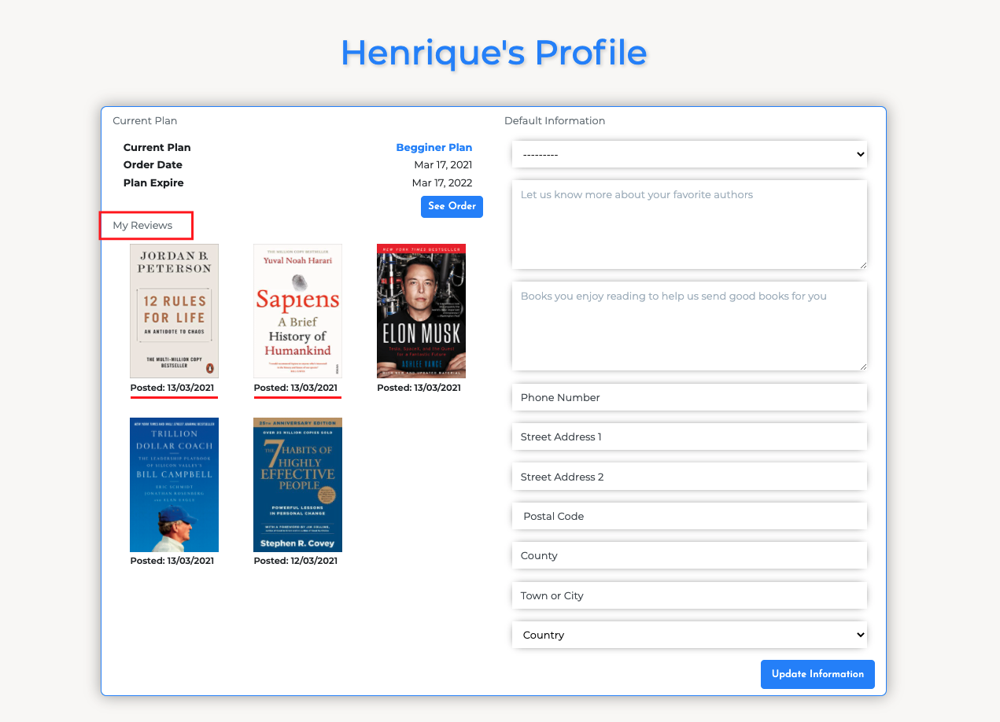
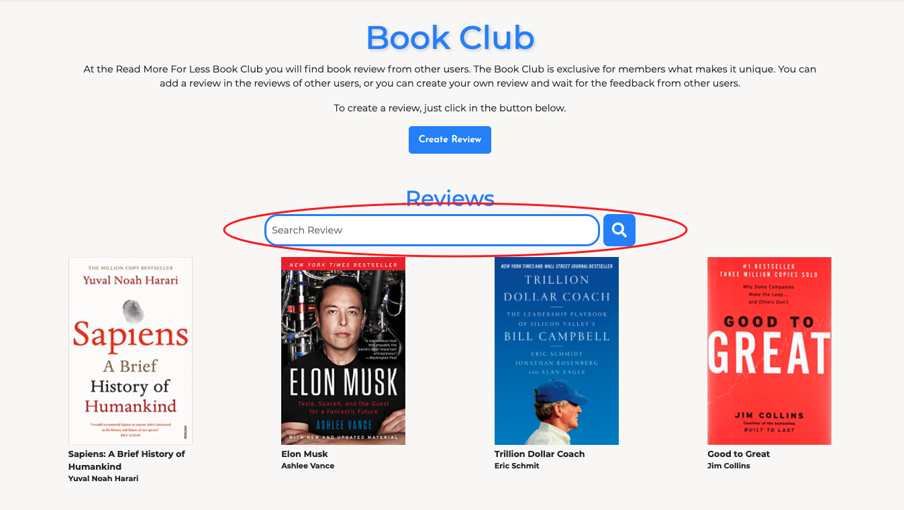
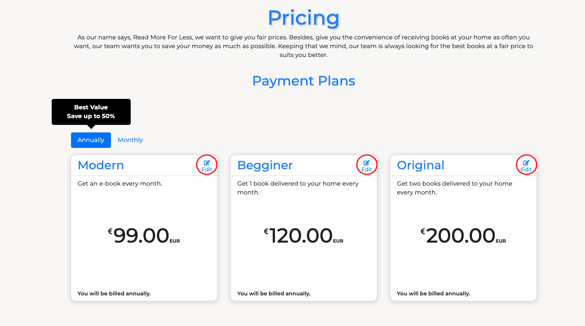

# Read More For Less Testing

## User Stories Testing
***

1. As a non-member, I want to visit the homepage to have a overview of what the site is about and pricing page to check the prices.

    **TEST**:
- After the user load the page the first thing they see on the home page is nice animation with a brief text explaining what the website is about.
- The Pricing page is visible for all users.

2. As a user, I want to easily understand the main purpose of the website so that I immediately know what the site is intended for upon entering.

    **TEST**:
- As mention above, after the user load the page the first thing they see on the home page is nice animation with a brief text explaining.

3. As a user, I want to be able to view the site on any device I may have, (mobile/tablet/desktop).

    **TEST**:
-  All pages were testing in different mobiles, from desktop with a width of 1920px to mobile of 320px width.

4. As a user, I want to easily sign up to the website.

    **TEST**:
- In the home, for large screens there are two buttons redirecting to the registrations page, one the navbar bar and the other in the intro text. For small screens only the button in the intro text is been displayed.

5. As a user, I want to easily log in and log out on my account.

    **TEST**:
- With two clicks the users can easily login into their accounts.

6. As a user, I want to set my Profile preferences and save it.

    **TEST**:
- In the Profile page the user can change their book preferences and delivery adress.

6. As a user, I want to check when I to know when my plan expire.

    **TEST**:
- In the Profile page the user can see their current order, with the start and end date

7. As a user, I want to participate of the Book Club, Creating, Editing and Deleting.

    **TEST**:
- Every registered user can create review in the Book Club.
- The user can update and delete the reviews they created.

8. As a user, I want to see my reviews in my profile with a direct link to the review.

    **TEST**:
- All reviews the user created are displayed in their profile, with the posted date and a direct link to the view review page.

9. As a user, I want be able to search for reviews.

    **TEST**:
- In the Book Club page the user can search for reviews by title or author.

10. As a admin/superuser, I want to have the ability to update site content.

    **TEST**:
- Only admin has the ability to add, update and delete plans.

## Apps Manual Testing
***
### General Testing
- Checked if all links in the navigation bar if they redirect to the desired pages.
- Check if the navigation bar responsiveness works as desired when screen size reduced below 922px
- Checked if the social links on the footer redirect to the desired page.

### Home
- Checked if the intro animation works as desired.
- Check if the intro animation only happens in screens larger than 992 pexels.
- Checked if the register buttons redirect to the registration page.
- Checked if the register only appears in large screens.

### Pricing
- Checked if the animation works as desired when loading the page.
- Checked if plans are adding to the cart by clicking in a pricing card.
- Checked if adding a plan to the cart the user is registereded to the cart.
- Checked if the user try to add more than one plan to the cart a error message is displayed.
- Checked if the user is not logged a error message saying they must logged in is displayed.
- Checked if tabs work as desired.
- Checked if the edit plan button only appears for the superuser.
- Verifield if after editing a plan the changes are saved.
- Checked if the delete modal show up and the delete button is clicked.
- Checked if the plan is delete from the database if the superuser delete it.
- Verifield if after adding a new plan it is saved in the data base.

### Cart
- Checked if non-authenticated users try to acess the cart page they will be redirect to the login page.
- Checked if the order summary is been displayed appropriately.
- Checked if the Clear Cart button clears the cart and redirect the user to the pricing page.
- Checked if the Book Preferences form work as desired, and if the changes are saved in the User Profile.
- Checked if the Checkout button redirected the user to the redirect page.

### Checkout
- Checked if the order summary is correct.
- Checked if the user had save the default informatiom in their profile show up correctly in the checkout form.
- Verifield the the payment funcionality works with sucessfull payments works as desired by filling in the checkout form, adding 4242 4242 4242 4242 in the card number, add 12/24 into MM/YY and 123 into CVC.
- Checked if the overlay animation while the form is been submited.
- Checked if the checkout success template display the correct information.
- Tested if the plan is deleted after in the end_date(one year after purchase).

### Profile
- Checked if the default information is saved after a purchase and if it can be edited.
- Checked if the current plan is been displayed correctly.
- Checked if the book reviews are been displayed.
- Checked if the book reviews links are redirecting to the rigth review.

### Book Club
- Checked if all reviews are being displayed.
- Checked if the search funcionality works as desired.
- Checked if the Create Review button redirect to add review page, and the funcionality of adding a review works as desired.
- Checked if when clicking in a review it redirects do the desired page.
- In the view review page checked if the reviews are been display correctly.
- In the view review page checked if the edit review button only appears for the review creator.
- In the view review page checked if the comments work as desired.
- In the edit review page checked if the changes are saved after editing a review.
- In the edit review page checked if the delete review funcionality works as desired.

