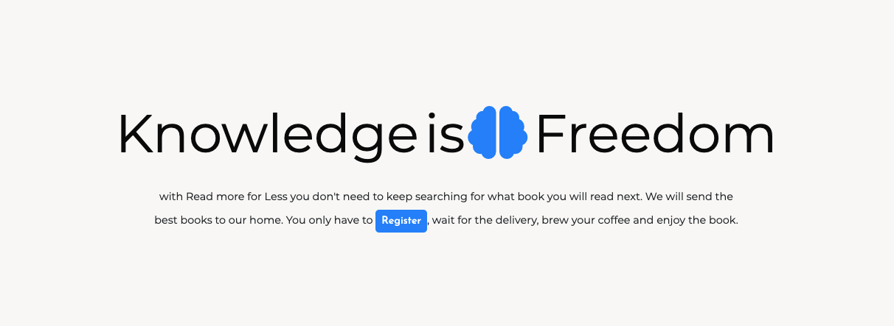
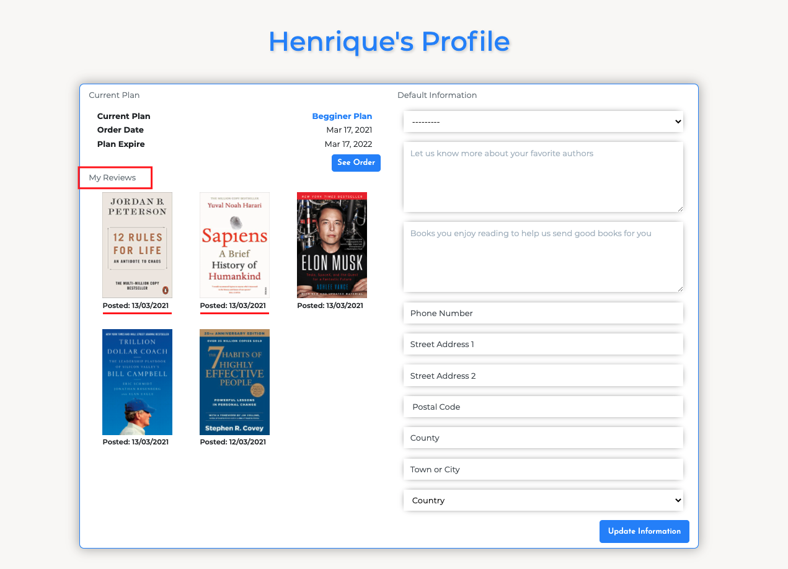
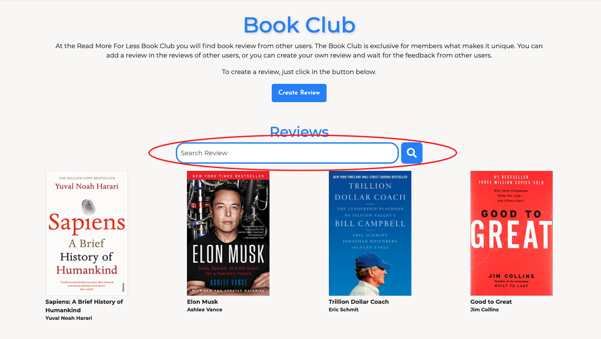
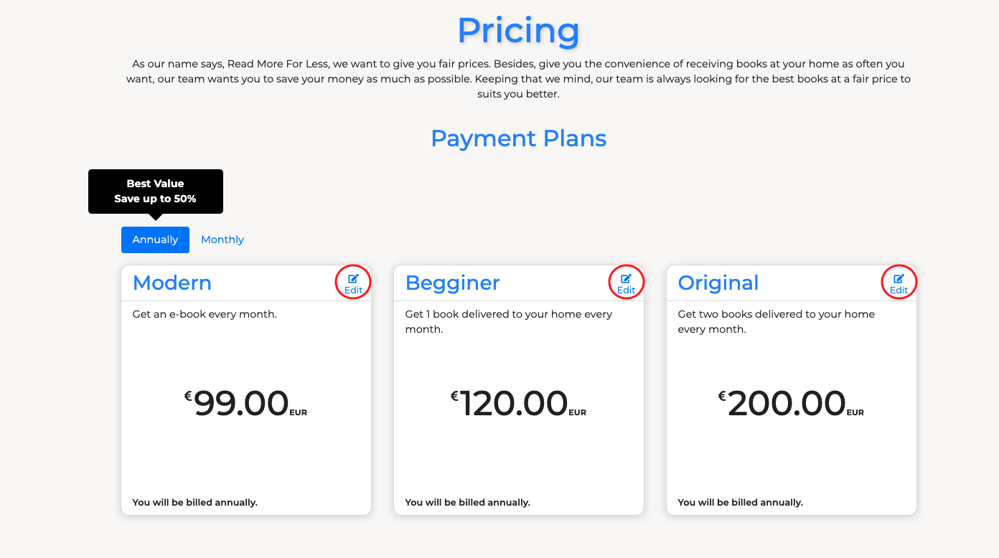

# Read More For Less Testing

## User Stories Testing

1. As a non-member, I want to visit the homepage to have a overview of what the site is about and the pricing page to check the prices.

    **TEST**:
- After the user loads the page the first thing they see on the home page is a nice animation with a brief text explaining what the website is about.
- The Pricing page is visible for all users.

2. As a user, I want to easily understand the main purpose of the website so that I immediately know what the site is intended for upon entering.

    **TEST**:
- As mention above, after the user loads the page the first thing they see on the home page is a nice animation with a brief text explaining.

3. As a user, I want to be able to view the site on any device I may have, (mobile/tablet/desktop).

    **TEST**:
-  All pages were testing in different mobiles, from desktop with a width of 1920px to mobile of 320px width.

4. As a user, I want to easily sign up to the website.

    **TEST**:
- In the home, for large screens, there are two buttons redirecting to the registrations page, one in the navbar bar and the other in the intro text. For small screens, only the button in the intro text is been displayed.

5. As a user, I want to easily log in and log out on my account.

    **TEST**:
- With two clicks the users can easily login into their accounts.

6. As a user, I want to be able to purchase a single instead of the regular one-year subscription.

    **TEST**:
- The user can choose between receiving a single delivery or a monthly delivery for one year.

7. As a user, I want to set my Profile preferences and save it.

    **TEST**:
- On the Profile page the user can change their book preferences and delivery address.

8. As a user, I want to check when my plan expires.

    **TEST**:
- On the Profile page the user can see their current order, with the start and end date.

9. As a user, I want to participate of the Book Club, Creating, Editing and Deleting posts with my profile.

    **TEST**:
- Every registered user can create review in the Book Club.
- The user can update and delete the reviews they created.

10. As a user, I want to see my reviews in my profile with a direct link to the review page.

    **TEST**:
- All reviews the user created are displayed in their profile, with the posted date and a direct link to the view review page.

11. As a user, I want to be able to search for reviews.

    **TEST**:
- On the Book Club page the user can search for reviews by title or author.

12. As an admin/superuser, I want to have the ability to update site content.

    **TEST**:
- Only the admin has the ability to add, update and delete plans.

## Apps Manual Testing

### General Testing
- Verified if all pages have correct content and functions as desired.
- Checked if all links in the navigation bar redirect to the desired pages.
- Check if the navigation bar responsiveness works as desired when screen size reduced below 922px.
- Checked if the social links on the footer redirect to the desired page.

### Home
- Checked if the intro animation works as desired.
- Check if the intro animation only happens on screens larger than 992 pixels.
- Checked if the register buttons redirect to the registration page.
- Checked if the register only appears on large screens.

### Pricing
- Checked if the animation works as desired when loading the page.
- Checked if plans are adding to the cart by clicking on a pricing card.
- Checked if adding a plan to the cart the user is registered to the cart.
- Checked if the user tries to add more than one plan to the cart an error message is displayed.
- Checked if the user is not logged an error message saying they must be logged in is displayed.
- Checked if tabs work as desired.
- Checked if the edit plan button only appears for the superuser.
- Verified if after editing a plan the changes are saved.
- Checked if the delete modal show up and the delete button is clicked.
- Checked if the plan is deleted from the database if the superuser deletes it.
- Verified if after adding a new plan it is saved in the database.

### Cart
- Checked if non-authenticated users try to acess the cart page they will be redirect to the login page.
- Checked if the cart icon with total only shows up in the navbar when an item is added to the cart.
- Checked if the order summary is been displayed appropriately.
- Checked if the Clear Cart button clears the cart and redirect the user to the pricing page.
- Checked if the Book Preferences form works as desired and if the changes are saved in the User Profile.
- Checked if the Checkout button redirected the user to the redirect page.

### Checkout
- Checked if the order summary is correct.
- Checked if the user had saved the default information in their profile show up correctly in the checkout form.
- Verified the payment functionality works with successful payments works as desired by filling in the checkout form, adding 4242 4242 4242 4242 in the card number, add 12/24 into MM/YY and 123 into CVC.
- Checked if the overlay animation while the form is been submitted.
- Checked if the checkout success template displays the correct information.
- Tested if the plan is deleted after the end_date(one year after purchase).

### Profile
- Checked if the default information is saved after purchase and if it can be edited.
- Checked if the current plan is been displayed correctly.
- Checked if the book reviews are been displayed.
- Checked if the book reviews links are redirecting to the right review.

### Book Club
- Checked if all reviews are being displayed.
- Checked if the search functionality works as desired.
- Checked if the Create Review button redirects to add review page, and the functionality of adding a review works as desired.
- Checked if when clicking in a review it redirects do the desired page.
- On the view review page checked if the reviews are been display correctly.
- In the view review page checked if the edit review button only appears for the review creator.
- In the view review page checked if the comments work as desired.
- In the edit review page checked if the changes are saved after editing a review.
- In the edit review page checked if the delete review functionality works as desired.

### Contact
- Checked if the form is been displayed as desired.
- Checked if General Query is set as default.
- Checked if the form won't submit if the required fields were left blank.
- Checked if the user is redirected to the home a success message is been displayed.
- Checked if an email letting the admin know about a new contact form submitted.

### User Login/Register system and templates
- The login and register procedure worked as expected.
    - Filled in the form with the details required and clicked register.
    - After the form submission, the user is redirected to the confirm-email saying a confirmation email has been sent to their email.
    - Once the user confirms their email, they are redirected to the login page with a successful message.
    - The user can easily log in and log out.
    - Checked if the Sign In with Google Account works as desired.
    

### Error pages
***
### 404
- Verified 404 page is displayed if navigate to an invalid link.
- Check if the Click Here button redirect to the home page.
### 500
- Verified if 500 page displays when an internal error happened.
- Check if the Click Here button redirect to the home page.

## Responsive Test
- Test responsiveness of website on all screen sizes using different browsers(Google Chome, Opera, Firefox and Microsoft Edge)
- Using Devtools test if everything displays as it should from 300px width up to 1920px.
- Viewed of different physical devices: Iphone 8(375px), Iphone 11(414px), Xiaomi Redmi 9(393px), medium laptop(1280px), large desktop screen(1920px).
- Repeat test in all pages.
